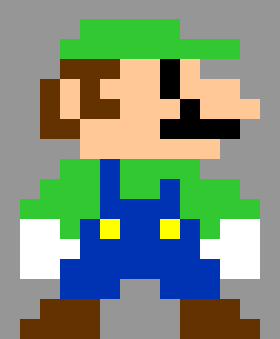
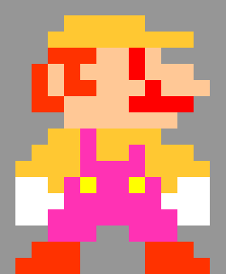

# Image Filtering
Use higher order functions to apply filters to images.

**Table of Contents**
- [Overview](#Overview)
  - [Learning Objectives](#learning-objectives)
  - [Project Grading](#project-grading)
- [TODOs](#todos)
  - [TODO 0: Study Existing Code (no coding)](#todo-0-study-existing-code-no-coding)
  - [TODO 1: Create the `applyFilter` Function](#todo-1-create-the-applyfilter-function)
  - [TODO 2: Create a Filter Function](#todo-2-create-a-filter-function)
  - [TODO 3: Update `applyFilter`](#todo-3-update-applyfilter)
  - [TODO 4: Create More Filter Functions](#todo-4-create-more-filter-functions)
  - [TODO 5: Create the `applyFilterNoBackground` Function](#todo-5-create-the-applyfilternobackground-function)
  - [Challenge Task: Smudge](#challenge-task-smudge)
  - [Submit Your Work](#submit-your-work)

# Overview

 ==> 

In this project you will be building a simple program that applies filters to images. You will also be creating multiple filters!

## Learning Objectives
- Practice working with multidimensional arrays
- Practice working with nested for loops
- Practice using higher order functions

## Project Grading

### Best Practices (15 points)

1. Use the built-in constants instead of magic numbers - 5 points
2. Use comments to describe your filters - 5 points
3. Use proper indentation - 5 points

### Program Progress (85 points)

* TODO 0 - 0 points, but important to go through anyway
* TODO 1 - 20 points
* TODO 2 - 10 points 
* TODO 3 - 10 points 
* TODO 4 - 20 points 
* TODO 5 - 25 points 
* Challenge - 25 points (bonus)
**NOTE:** the bonus will not give you a score of over 100 should you earn that many points, but can be done as an alternative to the required TODOs.

# TODOs

## TODO 0: Study Existing Code (no coding)

Before you begin working, you should look at the `image.js` file to see what has already been provided for you. In that file, you will find the following:

* `SQUARE_SIZE` constant - change this if you want to change the size of the image. Note that you will also need to change the corresponding CSS for the `.square` class's `width` and `height` properties.
* `RED`, `GREEN`, and `BLUE` constants - use these for index values when you create your filters.
* `image` data - use this variable to refer to the array storing the image data. Note that it contains only "rgb strings".
* `render` function - you will not need to use this; your program already calls the function
* `rgbStringToArray` function - use this to convert the "rgb string" values into arrays of numbers that are easier to process.
* `rgbArrayToString` function - use this to convert a numerical array back into an "rgb string". You will need to convert your filtered data back into a string for it to apply.

Once you have looked over the above and are comfortable with it, move on to the rest of the project below.

## TODO 1: Create the `applyFilter` Function
This TODO and all future TODOs should be completed inside of the `index.js` file.

Your first task is to create an `applyFilter` function. This is a big one, so we'll break it down into steps.

### Step 1: Make and Call the Function
First thing's first: make the function. Give it the name `applyFilter`, and for now, don't give it any parameters. That will change later, but it is good enough for now.

Once you've done that, call the function up in the "document on" section (this runs as soon as your web page has loaded -- you may have noticed this in other projects, as well).

### Step 2: Make the Loops
Next, make the nested loops to loop over your `image` data. Be careful not to mix up the counting variables of each loop.

### Step 3: Alter Your Image
Before moving on, go through TODO 0 if you haven't already to look at the code in `image.js`. The code in there can be used in your `index.js` file where you are currently working. This is important, because you will be using the `rgbStringToArray()` and `rgbArrayToString()` functions that were created in the `image.js` file.  

Now, for this step, you will need to alter your image. This should be done in the body of the inner loop, and is done in five steps (one line of code each, in order):

1. Pull out one of the string values from the `image` array. You will want to store this value in a variable (for example, you may want to call the variable `rgbString`).
2. Make a new `rgbNumbers` variable. Use `rgbStringToArray()` with `rgbString` as an argument to produce a new array. Store the array in the `rgbNumbers` variable.

**NOTE:** The `rgbNumbers` array (and any other array produced by `rgbStringToArray` consists of three values. Use the indices of `RED`, `GREEN`, and `BLUE` to access those three values. Each of them corresponds to the amount of red, green, or blue in the pixel that the array was created from.

3. Alter the contents of the `rgbNumbers` array. For now, simply change the `RED` value to its maximum (`255`). Don't forget that you have the `RED`, `GREEN`, and `BLUE` constants to use as indices for your `rgbNumbers` array.
4. Use `rgbArrayToString` to convert the `rgbNumbers` array back into a string (you may overwrite the `rgbString` variable with the new value).
5. Store the new `rgbString` back in the `image` array (put it at the same index location that you first pulled the original `rgbString` out of).

Once this is done, check your preview to see if your image became much more yellow/orange/red. If so, then you are ready for the next step!


## TODO 2: Create a Filter Function

This step is simple. Create a new function called `reddify` that takes a single array as an argument. This function should change the `RED` index of the array to have a value of `255`. 

That's it! There is no return or output for this function.

## TODO 3: Update `applyFilter`

Now, you need to make your `applyFilter` be a higher order function that uses other functions to apply filters to the image. This can be done in three steps.

1. Give your `applyFilter` function a single parameter called `filterFunction`. This parameter is going to store the filter function.
2. Up where you call your `applyFilter` function, plug `reddify` in as an argument. Remember that you are *not* calling `reddify` here.
3. Find the line where `applyFilter` changes the `rgbNumbers` array. Replace that line with a call to `filterFunction` with `rgbNumbers` as the argument to `filterFunction`.

If it works, then your preview should show your image tinted red. If it doesn't, check the following for errors:

* make sure that you are not calling `reddify` when you pass it as an argument to `applyFilter`
* make sure that you are not calling `filterFunction` in the parameter list
* make sure that you ***are*** calling `filterFunction` with `rgbNumbers` as an argument on the correct line

## TODO 4: Create More Filter Functions

Now that `applyFilter` is a higher order function, you should make more filters to pass to `applyFilter`. You must make at minimum the two filters below, but you can make more if you want.

### Filter 1: `decreaseBlue`
This filter should subtract at least `30` from the `BLUE` value of a pixel. Be sure to use `Math.max()` to make certain the value doesn't go below `0`!

### Filter 2: `increaseGreenByBlue`
This filter should add the `BLUE` value to the `GREEN` value of a pixel. Be sure to use `MATH.min()` to make certain that the value does not go over `255`!

### Apply the Filters
Once you have both filters created, apply all three of them by calling `applyFilter` 3 times, with each filter passed as arguments in turn.

## TODO 5: Create the `applyFilterNoBackground` Function

Now it's time to apply everything you've done all at once. 

Create a new function called `applyFilterNoBackground`. It should be identical to the `applyFilter` function except for one difference: it will not apply the filter to the background color!

It is up to you to figure out how to make this work, but here is one hint that you can use.

The background color can be gotten by looking at the top left pixel of your image. Any other pixel with that color, you can assume is part of the background! It might help if you simply compare the string stored in the top left pixel with the other pixels, rather than using arrays for comparison. Whatever you do, **do not hard code the value**.

Once you've got this function working, replace two of your three `applyFilter` function calls with `applyFilterNoBackground`. Good luck!

## Challenge Task: Smudge

As a final challenge, you can try to apply a smudge to your image. A smudge is where you take colors from neighboring pixels and slide them over, making it look like you smudged the image with your finger. You can even customize the smudge with filters to affect how much color (and even which colors!) you smudge over.

If you want to give this challenge a try, here are some hints as to how to proceed:

1. The best way to perform a smudge is to look at a neighbor pixel and copy **some** of its color over to the current pixel being altered. **DON'T** alter both at the same time. How you want to the neighbor to affect the current pixel should be determined by a new filter function.
2. You will need a different H.O.F. than either `applyFilter` or `applyFilterNoBackground`. This is only because the filter functions for smudging will require multiple arguments. 
3. The way you iterate over your `image` array will determine which direction you can apply the smudge (e.g. left, right, up, down, or some combination thereof)
4. Your filter function will need to take in at least two arguments (one for the pixel being altered and one for the neighbor pixel getting smudged over). If you are going to do a diagonal smudge (not recommended), then you will need more than two arguments for all pixels involved in the smudge.

# Submit Your Work

Submit your work regularly. Because these files are already being tracked by your GitHub repo, you can skip the "git add" step. Instead, enter the following commands:

```bash
git commit -a -m "saving image filtering"
git push
```

Congratulations on using using higher order functions!