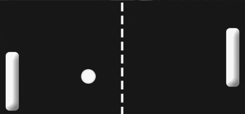

# Pong

Pong is a game played by two players who each control a paddle placed at opposite sides of the screen. A ball is hit back and forth between the two paddles, and the top and bottom walls, until the ball goes past one player's paddle. The player who misses the ball loses the point. The game ends when one player reaches 11 points.



**Table of Contents**
- [Learning Objectives](#learning-objectives)
- [Planning](#planning)
- [Grade Rubric and Schedule](#grade-rubric-and-schedule)
- [Helpful Code](#helpful-code)
  - [HTML for Game Items](#html-for-game-items)
  - [CSS for Game Items](#css-for-game-items)
  - [Use Objects to Manage Data](#use-objects-to-manage-data)
  - [Repositioning DOM Elements](#repositioning-dom-elements)
  - [Keyboard Inputs](#keyboard-inputs)
- [Collisions](#collisions)
- [Abstraction Example](#abstraction-example)
- [Submit Your Work](#submit-your-work)

# Learning Objectives
- Practice modeling data with Objects
- Reuse code from previous projects to create something new
- Practice abstraction
- Apply the algorithm for detecting collisions between objects

# Planning

Always start any programming task by clarifying what you want to do and then breaking it down into small steps. Small steps can get you just about anywhere if you’ve got enough time. If you get stuck, break it down smaller!

With your partner, consider each of these questions and make sure you are aligned on your answers:

### User Story / Gameplay
- Describe the gameplay
- What are the conditions when the game begins? 
- Does the game have an end? If so, what are the conditions for when it ends?
- What `if`s will there be?

### Visual Game Components:
- What are the visual game components? For example, in Bouncing Box, the game components were the board and the box.
  - Which will be static? (the board)
  - Which will be animated? (the box)
- What data will you need to manage each game component? For example, in Bouncing Box, the data values were `positionX`, `speedX`, and `points`.

### Events / Logic 
- What events will occur in this game? (timer events, keyboard events, clicking events?)
- How do those events affect the data of the program?
- For each "event", write out the high-level logic of what will happen. It is better (and tricky) to be as specific as you can while remaining high-level!

For example: in bouncing box, when the box is clicked:
1. The speed is increased
2. The point total goes up by 1 and is displayed on the box
3. The position of the box is reset to 0

# Grade Rubric and Schedule

## Best Practices (30 points)

1. All code in proper sections (setup, core, helpers, etc.) - 5 points
2. Use objects to store data - 5 points
3. Use comments to describe setup and functions - 5 points
4. Avoid magic numbers - 5 points
5. Use helper functions to separate concerns - 5 points
6. Generalize functions (i.e. only one collision detection function for all ball-paddle collisions; hard-coding to check both in a single function doesn't count) - 5 points

## Program Content (70 points)

### Week 1

1. Get the ball, paddles, and two score boxes to display on screen - 10 points
2. Declare variables to store the data for the program - 5 points
3. Respond to keyboard events - 15 points
4. Update paddle positions - 5 points
5. Handle paddle-wall collisions - 5 points

### Week 2

1. Use a factory function to create objects - 5 points
2. Get the ball moving at game start (should be random to a degree) - 5 points
3. Handle ball-wall collisions (non-scoring) - 5 points
4. Handle scoring (increase score and reset ball) - 5 points

### Week 3

1. Handle ball-paddle collisions - 5 points
2. End the game after a certain score (no more than 11) - 5 points

# Helpful Code

Below are some code we've written in the past that may be helpful to you in this project:

### HTML for Game Items:

Open the `index.html` file. You should see this in the body:

```html
<body>
  <div id='board'>
    <div id='gameItem'></div>
  </div>
</body>
```

Each project in this class will be build on some kind of `board` with various `gameItems` that are on the board. For this project, there are a number of required game items:
- the left paddle
- the ball
- the right paddle
- the score for player1
- the score for player2

Each one of these game items needs to be represented in HTML and, for the most part, `<div>`s can be used. To create a `<div>` with a particular `id` attribute, place the `id=""` attribute inside the opening tag:

```html
<div id="uniqueGameItemName"> </div>
```

Not all of these game items will need objects. It is up to you to decide which ones do and which ones don't. You also may want more elements than just the ones mentioned, but those are the bare minimum required.

### CSS for Game Items

Open the `index.css` file.

Adding CSS makes our gameItems actually become visible. For all projects in this course, we'll be using simple 2D shapes since they are relatively easy to render with basic HTML and CSS skills.

The following properties will be useful for determining the appearance of our DOM elements:
- `background-color`: the color of the element
- `width`: the width of the element in pixels
- `height`: the height of the element in pixels
- `border-radius`: how rounded the edges of the element are. Leaving out this property will leave the element as a rectangle. Setting this value to half of `width` or `height` will make the shape a circle (assuming width and height are the same).

The following properties will allow us to place our elements anywhere on the screen, relative to the `board`.
- `position: absolute`: allows us to use the `top` and `left` properties to position HTML elements anywhere we want on the screen relative to the parent element. 
- `top`: the y-coordinate location of the element on a flipped y-axis (value increases as you move downwards).
- `left`: the x-coordinate location of the element.

Overall, the CSS should look like this:

```css
#id {
  /* appearance */
  background-color: white;
  width: 20px;
  height: 20px;
  border-radius: 20px;
  
  /* positioning */
  position: absolute;
  top: 100px;
  left: 100px;
}
``` 

Suggestions for this project:
- Each paddle should have a unique `background-color`
- Both paddles should have `width: 20px;` and `height: 80px;`
- The ball should have `width:20px;`, `height:20px` and `border-radius: 10px;`

### Repositioning DOM Elements

We'll need to reposition the ball and each paddle on each update of the timer. Luckily, we've learned how to move things in the past by keeping track of:
- `x` (or `positionX`): the coordinate location of the game item along the x axis
- `speedX`: the speed (distance over time) and direction (+/-) of the game item along the x axis

And by using the jQuery `.css()` function to draw the element in the new position by changing how far the `$element` is from the `"left"` of the screen: 

```js
$element.css("left", newPositionX)
```

For example, in bouncing box, we have the following function:

```js
function moveBox() {
  positionX += speedX;                 // update the position of the box along the x-axis
  $("#box").css("left", positionX);    // draw the box in the new location, positionX pixels away from the "left"
}
```

If we wanted to move the box vertically, we could also keep track of `positionY` and `speedY` and use the jQuery `.css()` function to change the `"top"` property:

```js
$element.css("top", positionY)
```

### Use Objects to Manage Data

We will need to manage the data for each game item in this project: the ball and each paddle. 

Use objects to manage this data. For example, in bouncing box, we could organize the data for the box like so (shortening `positionX` and `positionY` to `x` and `y`:

```js
var box = {};
box.x = 0;
box.y = 100;
box.speedX = 1;
box.speedY = 1;
box.id = "#box";
```

Notably, we are now storing the id of the HTML element in a variable. This will tie the data that manages each game item to the HTML element that is being controlled.

For bouncing box, we would refactor the `moveBox()` function this:

```js
function moveBox() {
  box.x += box.speedX;              // update the position of the box along the x-axis
  $(box.id).css("left", box.x);  // draw the box in the new location, positionX pixels away from the "left"
}
```

Since you'll be creating objects to represent the ball and each paddle, I highly recommend using a factory function to ensure that each `gameItem` has the data below:
- `gameItem.id`
- `gameItem.x`
- `gameItem.y`
- `gameItem.speedX`
- `gameItem.speedY`

When creating a factory function, the function should return an object that has a specific set of properties already assigned to it. The properties that you want customized for each object should be **parameterized** (turned into parameters/variables).

For example, consider this data for animal objects:

```js
var spot = {};
spot.name = "spot";
spot.species = "dog";
spot.owner = "Farmer Fred";

var daisy = {};
daisy.name = "daisy";
daisy.species = "bird";
spot.owner = "Farmer Fred";

var bessy = {};
bessy.name = "bessy";
bessy.species = "cow";
spot.owner = "Farmer Fred";
```

Since each object shares the same properties; `name`, `species`, and `owner`, I can create a factory function that reduces the repetitive creation of those objects.

For each value that is unique, I will add a parameter to my factory function. Any values that are shared can be hard-coded into the object.

```js
// Initialization
var spot = Animal("spot", "dog");
var daisy = Animal("daisy", "bird");
var bessy = Animal("bessy", "cow");

// Helper Functions
function Animal(name, species) {
  var animal = {};
  animal.name = name;
  animal.species = species;
  animal.owner = "Farmer Fred";
  return animal;
}
```

### Keyboard Inputs

This function assumes that the event `"keydown"` is being listened for. You can change what events are being listend for in the function `turnOnEvents` of the template. 

What your program does in response to particular keys is up to you. Check out the [Walker project](https://github.com/benspector3/asd-template-keyboard-intro/) for ideas on how to move an object with your keyboard.

```js
var KEYCODE = {
  ENTER: 13,
}

function handleKeyDown() {
  var keycode = event.which;
  console.log(keycode);
  
  if (keycode === KEYCODE.ENTER) {
    console.log("enter pressed");
  }
}
```

Use https://keycode.info/ to find out the keycode for any key. 

# Collisions	

In games, collisions will occur frequently between objects. Having a function that can tell if two objects are colliding would be really convenient! The outline for such a function looks like this:

```js
function doCollide(obj1, obj2) {
  // return false if the objects do not collide
  // return true if the objects do collide
}
```

and we would use such a function in our program like this:

```js
if (doCollide(ball, paddleLeft)) {
  // bounce ball off paddle Left
}
```

Any object passed to our `doCollide` function should store the data for an HTML element. Therefore, they must have an `$element` storing the jQuery object for the HTML element as well as `x` and `y` properties that store where the `$element` is. 

If you haven't set up your object data to represent the ball and the paddles, go back and do so before continuing

For now, let's assume that we have a generic `gameItem` that is passed to the function as one of our objects. It's HTML, CSS, and JavaScript look like this:

```html
<div id="gameItem"></div>
```

```css
#gameItem {
  position: absolute;
  left: 100px;  /* distance from the left side of the screen */
  top: 50px;    /* distance from the top of the screen */
}
```

```js
var gameItem = {};
gameItem.$element = $("#gameItem");
gameItem.x = 100;   // same as "left"
gameItem.y = 50;    // same as "top"
// speedX and speedY aren't needed for now
```

Assuming that you are dealing with two `gameItem` objects, `objA` and `objB`, the `doCollide` function's pseudocode would look like this:

```js
IF the left side of objA is left of the right side of objB AND
  the right side of objA is right of the left side of objB AND
  the top side of objA is above the bottom side of objB AND
  the bottom side of objA is below the top side of objB: 
  return true
ELSE:
  return false
```

# Abstraction Example	

> Abstraction is the process of turning something specific (hard-coded) into something generic (reusable)	

Repetitive code presents an opportunity to refactor for abstraction. Abstraction helps us to follow the D.R.Y. principle (don't repeat yourself).	

To refactor repetitive code for abstraction, you can follow these 3 steps:	
1. identify the repetetive statements and turn those statements into a new function declaration	
2. identify the changing expressions/data (if any) and turn those expressions/data into parameters	
3. replace repetitive code with function calls	

Below is an example of refactoring for abstraction. Consider the following code which simulates rolling dice of different sizes:	

```js
var roll1 = Math.ceil(Math.random() * 6);	
var roll2 = Math.ceil(Math.random() * 10);	
var roll3 = Math.ceil(Math.random() * 20);	
```

Each time I roll the dice I am using the `Math.ceil()` and `Math.random()` functions, the `*` operator and a number value. These statements can be turned into a new function declaration.	

```js	
function rollDice() {	
  return Math.ceil(Math.random() * 6); // the 6 should be a parameter, not hard-coded	
}	
var roll1 = rollDice(6);	
var roll2 = rollDice(10);	
var roll3 = rollDice(20);	
```

However, we want the number value `6` to change each time we call the function. That value must be replaced with a parameter:	

```js	
function rollDice(sides) {	
  return Math.ceil(Math.random() * sides);	
}	
var roll1 = rollDice(6);	
var roll2 = rollDice(10);	
var roll3 = rollDice(20);	
```

# Submit Your Work

Submit your work regularly. Because these files are already being tracked by your GitHub repo, you can skip the "git add" step. Instead, enter the following commands:

```bash
git commit -a -m "saving pong"
git push
```

Congratulations on completing Pong!