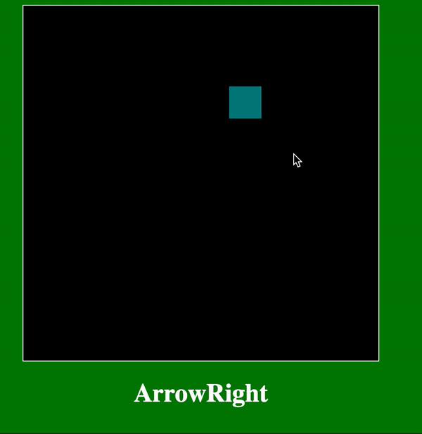
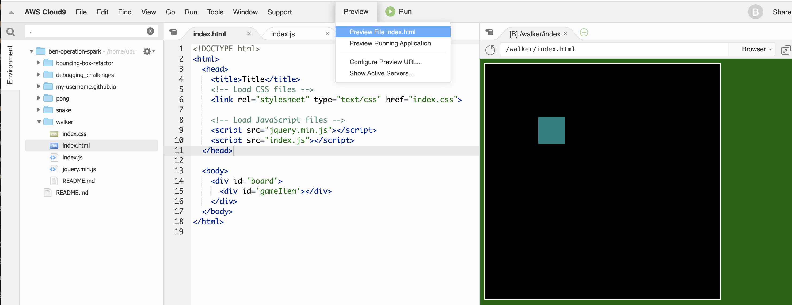
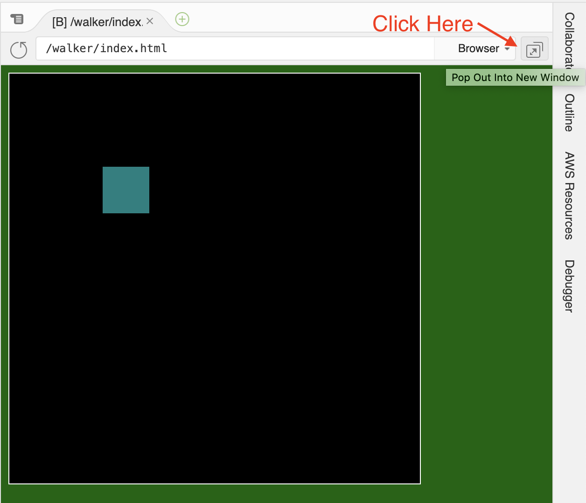
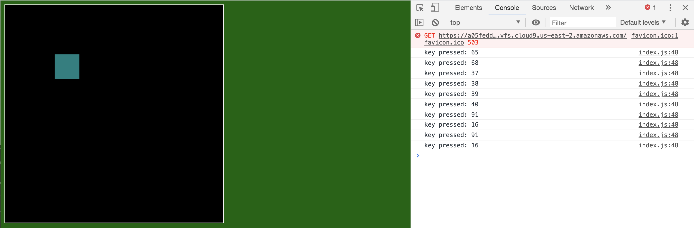

# Box Walker

**Table of Contents**
- [Overview](#Overview)
  - [Learning Objectives](#learning-objectives)
  - [Project Grading](#project-grading)
- [TODOs](#todos)
  - [TODO 0: Understand the Template (no coding)](#todo-0-understand-the-template-no-coding)
  - [TODO 1: Register Keyboard Inputs](#todo-1-register-keyboard-inputs)
  - [TODO 2: React to Specific Keycodes](#todo-2-react-to-specific-keycodes)
  - [TODO 3: Declare `gameItem` Variables](#todo-3-declare-gameitem-variables)
  - [TODO 4: Declare Some Helper Functions](#todo-4-declare-some-helper-functions)
  - [TODO 5: Update `speedX` and `speedY` with the Keyboard](#todo-5-update-speedX-and-speedY-with-the-keyboard)
  - [TODO 6: Reset `speedX` and `speedY` on `"keyup"`](#todo-6-reset-speedx-and-speedy-on-keyup)
  - [Challenge Ideas](#challenge-ideas)
  - [Submit Your Work](#submit-your-work)

# Overview



In this project we will be building a simple program that allows us to control the movement of a box with the arrow keys. As a challenge, try limiting the movement of the "walker" to the boundaries of the board. Then, add a second "walker" and turn the program into a game of tag!

## Learning Objectives
- Become familiar with the template repository
- Apply lesson on detecting keyboard inputs
- Make connections to the Bouncing Box program and recognize patterns
- Continue to practice using jQuery

## Push Reminder
To push to GitHub, enter the following commands in bash:
```
git add -A
git commit -m "saving walker"
git push
```

## Project Grading

### Best Practices (30 points)

1. All code in proper sections (setup, core, helpers, etc.) - 10 points
2. Use comments to describe setup and functions - 10 points
3. Use helper functions to separate concerns - 10 points

**NOTE:** Incomplete programs will receive partial credit based on the number of TODOs completed with the above best practices in place.

### Program Progress (70 points)

* TODO 0 - 0 points, but important to go through anyway
* TODO 1 - 10 points
* TODO 2 - 15 points 
* TODO 3 - 10 points 
* TODO 4 - 10 points 
* TODO 5 - 10 points 
* TODO 6 - 15 points 
* Challenge 1 - 5 points (bonus)
* Challenge 2 - 5 points (bonus)
* Challenge 3 - 10 points (bonus)
**NOTE:** the bonus will not give you a score of over 100 should you earn that many points, but these challenges will help you out much later if you can do them.

# TODOs

## TODO 0: Understand the Template (no coding)

Before we begin coding, open the `index.html` file and press **Preview** to see what we're starting with. It looks like the beginning of bouncing box, right?



Take 10 minutes to look at the code in each of the three files to get a sense of how this template is laid out. 

Pay attention to the following:

### The `index.html` file

The body only has 2 elements: the `#board` and a single `#gameItem`. It should look like this:

```html
<body>
  <div id='board'>
    <div id='gameItem'></div>
  </div>
</body>
```

Each game we create this semester will have a board of some sort with various game items. Often, you will have many more game items that you'll either create manually, or dynamically added to the board later using jQuery.

Remember that these two elements have unique `id` attributes, which means that we can select them using the following CSS selectors:
- `#board`
- `#gameItem`

### The `index.css` file

The games we will build this semester will all use 2D graphics since we are limiting ourselves to HTML and CSS. Most of the shapes can be easily drawn as rectangles using the `width` and `height` properties. 

Rectangles can be made into circles by adding a `border-radius` property.

**Add a `border-radius` property to the `#gameItem`. To make it a perfect circle, set the `border-radius` to the same value as the `width` and `height`.**

Also, pay attention to the value for the `position` properties set for the `#board` and the `#gameItem`. 

Notice that the parent element (`#board`) has the `position: relative` property while the child element (`#gameItem`) has the `position: absolute` property. This combo means that the child element can be placed anywhere inside the parent element by manipulating the `left` and `top` properties. 
- `left` is the x-coordinate, or distance from the left
- `top` is the y-coordinate, or distance from the top

_Note: There are also `right` and `bottom` properties but we'll stick with `top` and `left` for consistency._

### The `index.js` file

Look at the code written under each header. Remember:
- Setup: variable declarations, any one-off statements needed to start the program
- Core Logic: The main logic driving the program. Should delegate work to helper functions.
- Helper Functions: functions that help implement the core logic.

## TODO 1: Register Keyboard Inputs

**READ:**
Open the `index.js` file. 

Our first task is to make our game register `"keydown"` events and respond to them. We'll keep the response simple for now until we know that our code is working.

In the SETUP section, find where the event handler's are registered (`$(document).on('eventType', handleEvent)`.

**CODE:**
1. Modify the code such that, instead of calling `handleEvent`, it calls a different function: `handleKeyDown`.
2. Make sure that it is called in response to `"keydown"` events.
3. Find the event handler function `handleEvent` and change its name to `handleKeyDown`. Inside, add a `console.log()` statement to its `{code block}` that prints the keycode of the key pressed:

Together, these components will look like this:

```js
// SETUP...
$(document).on('keydown', handleKeyDown);

// CORE LOGIC...
function handleKeyDown(event) {
  console.log(???);
}
```

**HINT:** How do you know _which_ key was pressed from the given `event` object? Check out <a href=https://keycode.info/>keycode.info</a> for help!

**READ:**
Save your code and refresh your game. Open the running application in a new window (see below)



Open the console, then press keys to make sure that the events are properly being registered.



## TODO 2: React to Specific Keycodes

Now that we know our `"keydown"` events are being handled, let's figure out exactly _which_ keys are being pressed. 

**CODE:**
1. Declare a new _constant variable_ `KEY` in the SETUP section and assign an Object to it. The object should map the following keys: `"LEFT"`, `"UP"`, `"RIGHT"`, `"DOWN"`, to their respective keycodes. For example, the keycode for the _Enter_ key is `13`:

Example: 

```js
var KEY = {
  "ENTER": 13,
}
```

2. Now, modify your `handleKeyDown` function such that it can react differently to our target keys. For example, if I wanted to print out `"enter pressed"` when the _Enter_ key is pressed, I could write:

```js
function handleKeyDown(event) {  
  if (event.which === KEY.ENTER) {
    console.log("enter pressed");
  }
}
```

Modify this function such that it can print out `"left pressed"` when the left arrow is pressed. Do the same for the other  three arrow keys.

3. Save your code and refresh your application in the other window. Test it to make sure that the right messages are being printed to the console.

## TODO 3: Declare `gameItem` Variables

**READ:**
Now that we can determine which keys are being pressed, we can move on to the problem of moving the `gameItem`. 

This is actually a problem we've already solved in **Bouncing Box**. To move the box, we needed the following data:

```js
var positionX = 0; // the x-coordinate location for the box
var speedX = 0; // the speed for the box along the x-axis
```

For this project, we want to be able to move along the x-axis _AND_ the y-axis.

**FIND:**
Because this involves variable declarations global to the project, it should go up in the SETUP section.

**CODE:**
Declare 4 variables for the `gameItem` such that we can monitor and control the following information:
- the x-coordinate location
- the y-coordinate location
- the speed along the x-axis
- the speed along the y-axis

**Initialize each variable to hold the value `0`**

## TODO 4: Declare Some Helper Functions

**READ:**
Now that we have our data tracking in place, we need to use that data to actually move the `gameItem` on each `update`. Again, this is a problem solved in Bouncing Box:

To reposition the box we wrote:

```js
positionX += speedX; // update the position of the box along the x-axis
```

And to redraw the box in the new x-location we wrote:

```js
$("#box").css("left", positionX);    // draw the box in the new location, positionX pixels away from the "left"
```

**CODE:**
1. In the HELPER FUNCTIONS section, declare two new functions called `repositionGameItem()` and `redrawGameItem()`.
2. Reference the code above to complete these two functions such that they can reposition and redraw the GameItem to move along the x-axis AND the y-axis. 
2. Call each function on each `newFrame`.

**HINT:** Use the `"top"` CSS property to draw the box `y` pixels from the `"top"`
**HINT:** Check what the id of the GameItem is for your jQuery statements.

Save your code and refresh the game. If you try pressing keys you'll notice that the box isn't moving. 

## TODO 5: Update `speedX` and `speedY` with the Keyboard

**READ:**
The box isn't moving yet because we initialized `speedX` and `speedY` to `0`. As long as `speedX` is `0`, the `gameItem` will not move along the x-axis. Same goes for `speedY` and the y-axis.

When we press a key, we want the `gameItem` to move in that direction which we can accomplish by, for example, setting `speedX` to some positive number when the right arrow is pressed and setting to a negative value when the left arrow is pressed. Then, on the following `newFrame`, the position of `gameItem` will be recalculated based on the the code we wrote in TODO 4.

**CODE:**
Modify your `handleKeyDown` function such that when the `KEY.LEFT` key is pressed, the `speedX` is set to `-5`:

```js
if (event.which === KEY.LEFT) {
  speedX = -5;
}
```

Do the same for the other 3 arrow keys.

**Question: Why does the box only move diagonally after your press the keys?**

## TODO 6: Reset `speedX` and `speedY` on `"keyup"`

**READ:**

We now have motion! However, the `gameItem` doesn't stop moving once we set it off. We need some way to stop it from moving. 

Ideally, the `gameItem` would stop moving once we release the arrow key. This `"keyup"` event can be listened for in the same way that the `"keydown"` event can be listened for.

**CODE:**
Similar to the code that you've already written in TODO 5, set up your program to listen for `"keyup"` events and set the `speedX` and `speedY` variables to `0` whenever the arrow keys are released.

# Challenge Ideas:

## Prevent the box from leaving the bounds of the board.

How does this new concern relate to the existing concerns?

## Add a second player that can be controlled with WASD

What will you need to add to the setup area? What will you need to add to the core logic? What new helper functions will you need?

## Detect when the two players collide to make a "tag" game. 

After the two players collide, make the player who is "it" turn red and move each player to the opposite corners of the screen.

# Submit Your Work

Submit your work regularly. Because these files are already being tracked by your GitHub repo, you can skip the "git add" step. Instead, enter the following commands:

```bash
git commit -a -m "saving walker"
git push
```

Congratulations on completing Walker!