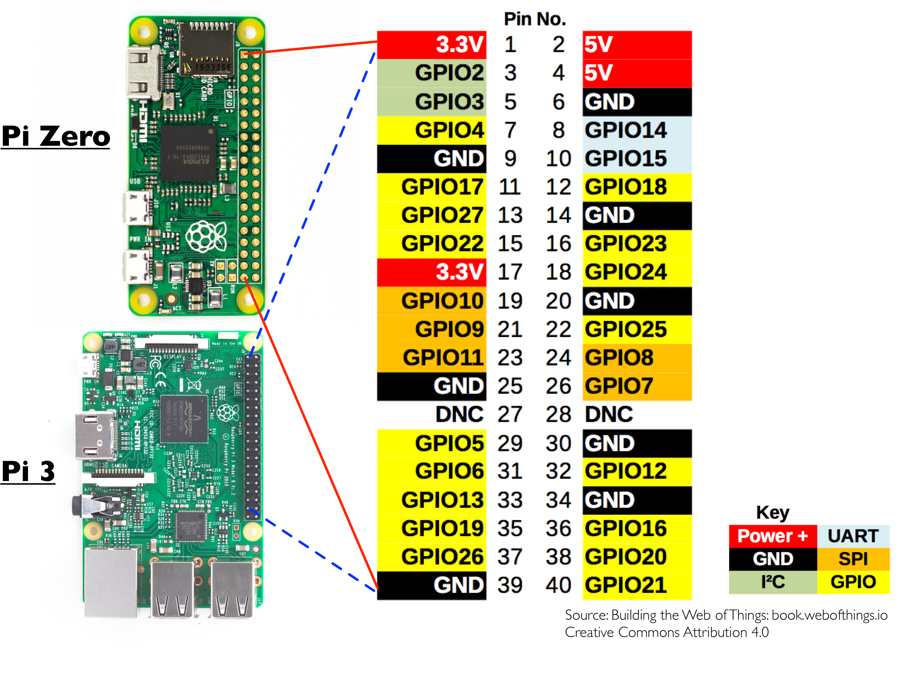

# hardware-tests
PROJECT: Put together your Pi's hardware and some small programs to test it

**Table of Contents**
 
- [Setup](#setup)
- [Lesson Steps](#lesson-steps)
    - [The Breadboard](#the-breadboard)
    - [The PIR Sensor](#the-pir-sensor)
        - [PIR TODO 1: Hardware](#pir-todo-1-hardware)
        - [PIR TODO 2: Program Initialization](#pir-todo-2-program-initialization)
        - [PIR TODO 3: Watch the Sensor](#pir-todo-3-watch-the-sensor)
        - [PIR TODO 4: Exit Handling](#pir-todo-4-exit-handling)
    - [The DHT Sensor](#the-dht-sensor)
        - [DHT TODO 1: Hardware](#dht-todo-1-hardware)
        - [DHT TODO 2: Program Initialization](#dht-todo-2-program-initialization)
        - [DHT TODO 3: Watch the Sensors](#dht-todo-3-watch-the-sensors)
        - [DHT TODO 4: Exit Handling](#dht-todo-4-exit-handling)
    - [The LEDs](#the-leds)
        - [LED TODO 1: Hardware](#dht-todo-1--hardware)
        - [LED TODO 2: Program Initialization](#led-todo-2-program-initialization)
        - [LED TODO 3: Manipulate LEDs](#led-todo-3-manipulate-leds)
        - [LED TODO 4: Exit Handling](#led-todo-4-exit-handling)

## Setup

Log into Pi through putty (or terminal if on a mac).
Put into bash terminal:
* `git clone <your GitHub repository's URL>`
* `cd <your GitHub repository's name>`
* `cd iot-projects/hardware-tests/tests`
* `npm install onoff node-dht-sensor epoll`

## Lesson Steps
There are four separate rounds of hardware setup involved in this project. The first round is preliminary, and sets up what is called a breadboard. The second round will attach an infrared motion detector, the third a dual temperature/humidity sensor, and the fourth a pair of LEDs. After the second, third, and fourth rounds each, you will put together a little program to test the hardware you've put together thus far. 

<h3>Important</h3> Note all programs written, they must be run on your Pi. Feel free to write them on a different machine, but you will need to copy them over to your Pi before you can test them.

For all of the steps, it might be helpful to refer to the below image, which you might find useful to keep a copy of open in a separate tab to avoid continually scrolling up and down for.



Now, before you get started, there are three important things you should keep in mind. 

First, it is extremely important that you attach wires to the pins and location exactly as described. If you don't, then the setup won't work. 

Second, don't stress out too much about making a mistake. The hardware won't work if you plug something into the wrong place, but it also won't break. If at first you don't succeed, just try again!

Finally, please note that GPIO pin numbers don't match up with raw pin numbers. For instance, pin number 7 is actually GPIO pin 4. This is partially because not all pins are GPIO pins and partially because the GPIO pins simply aren't in order.

### The Breadboard
Now that you're ready to get started, your first task is to set up the breadboard. You will be using the breadboard as a partial intermediary between your sensors and the PI itself. While this is not stricly necessary since we are only using two sensors, if you later want to add more this setup will be useful.

* **Step 1:** connect a wire from Pin 2 to one of the + rows on the breadboard
* **Step 2:** connect a wire from Pin 6 to one of the - rows on the breadboard

That's it! You've got the base for all of the rest of the hardware powered and ready to go.

### The PIR Sensor
The first sensor you will be attaching is the passive infrared sensor, or PIR. Once you've connected the hardware, you will also put together a short program to test it. 

#### PIR TODO 1: Hardware
The PIR sensor has three prongs. If they are facing upwards and on the edge closest to you, then **the right prong is the ground, the middle is the signal, and the left is the VDC,** which you can think of as the power.

* **Step 1:** connect a wire from the ground prong to the breadboard’s - row (the same row connected to the PI)
* **Step 2:** connect a wire from the VDC prong to the breadboard’s powered + row (again, the same row connected to the Pi)
* **Step 3:** connect a wire from the signal prong directly to Pin 7 on the Pi

#### PIR TODO 2: Program Initialization
Create a file called "pir.js" and put in the following two lines:

```js
var Gpio = require('onoff').Gpio;
var sensor = new Gpio(4, 'in', 'both');
```

The first line will import the "onoff" gpio library, which is great for sending or receiving Boolean messages. The second sets up a connection with GPIO pin number 4, telling the program to expect incoming messages. As for why, GPIO pin 4, keep in mind that even though you connected the sensor to pin 7, that pin is actually labeled GPIO 4 in the diagram, as not all pins are GPIO pins.

#### PIR TODO 3: Watch the Sensor
Next, you need to tell the program what to do when it receives a signal from the sensor. You can do this by adding in a call to `Gpio.watch()`. Since you named the variable storing your GPIO connection "sensor", you would call it by typing `sensor.watch()`. This function takes a single callback function as its argument, and that callback function should take two parameters, one for an error and one for incoming data. 

An example of a bare minimum call for you would be:

    sensor.watch(function (err, value){});

What you should do is customize your callback function to display a different message depending on if your sensor detects motion or not. Because it's a Boolean sensor, "value" will be either true if something has been detected or false if not.

#### PIR TODO 4: Exit Handling
Finally, you need to handle how to exit the program. You will want to officially disconnect from the sensor and shut down if your program receives the signal to terminate. 

To do that, first you will need to create a function to handle those tasks. Let's call it exit. You can just use the below code for that.

```js
function exit(err) {
  sensor.unexport();
  process.exit();
}
```

The line `sensor.unexport()` is what disconnects the program from your GPIO pin. The line `process.exit()` shuts down your program. Feel free to add in code to print out any errors that occurred, if you want. The "err" parameter would hold that information.

After you've created a function to handle exiting the program, you just need to register it to activate if your program is ever given the termination signal (you can send that signal in a few ways, but the simplest is to type CTRL C into the terminal where it's running).

This registration can be done using the `process.on()` method as follows:

    process.on('SIGINT', exit);

#### Test the hardware
After that's written, you can run your program by typing `node pir.js`, assuming you are in the same directory as "pir.js". If both the hardware and program are set up properly, (and you're running on the Pi and not your desktop) you should start seeing messages appear in your terminal.

### The DHT Sensor
The second sensor you will be attaching is the dual humidity temperature sensor, or DHT. Specifically, we are using the DHT-22, which is important to know when you write any programs that interact with it. Just as with the PIR, once you've connected the hardware, you will create a small test program to verify the connections are all correct. 

#### DHT TODO 1: Hardware
There are two types of dht sensors you might have. Look at the two below situations to determine which set of steps you should follow. 

### If your sensor has four prongs, follow these instructions:
The DHT-22 sensor has four prongs. With the grill of the device face up and the prongs facing you, **the first prong is the VDC (power) prong, the second is the signal, the third is unused, and the fourth is the ground.**

* **Step 1:** Use a wire to connect the power prong to the breadboard’s + row
* **Step 2:** Use a wire to connect the ground prong to the - row
* **Step 3:** Use a wire to connect the signal prong directly to the Pi’s Pin 11

### If your sensor comes with wires already attached, follow these instructions:
**The red wire is the VDC (power), the yellow is the signal, and the black is the ground.**

* **Step 1:** Connect the power wire to the breadboard’s + row
* **Step 2:** Connect the ground wire to the - row
* **Step 3:** Connect the signal wire directly to the Pi’s Pin 11

#### DHT TODO 2: Program Initialization
Create a file called "DHT.js" and put in the following two lines:

```js
var sensorLib = require('node-dht-sensor');
sensorLib.initialize(22, ?); 
```

The first line will import the "node-dht-sensor" gpio library, which is designed specifically for the DHT class of sensors. The second line initializes the library by specifying which model of DHT you are using (in this case 22) and which GPIO pin it should connect to. Here, you need to figure out which GPIO number goes there. Remember, even though the signal prong should be connected to Pin 11 on your Pi, that is not the Pin's GPIO number. You need to look it up on the diagram to figure it out.

#### DHT TODO 3: Watch the Sensors
Listening to a DHT sensor is a bit different than listening to the PIR. There are special methods that must be called, and it's most convenient to put them in a wrapper function that can be scheduled to run at a set interval. 

So, step one is to create a wrapper function called "read" that takes no input parameters. The first line of this function will be 

      var readout = sensorLib.read();

This will store the current sensor data in the variable "readout". You can then get the temperature and humidity values via `readout.temperature` and `readout.humidity`, respectively. You should print out these values within the function to verify that you are reading them correctly (Hint: look up how to use `toFixed()` to set the numerical precision of a number for cleaner output).

Once you've written your "read" function, you need to schedule it. You can do that using a function called `setInterval()`. You pass "setInterval" a function to be run as its first argument and a numerical value in milliseconds for its second argument. The provided function will then be called every time the provided number of milliseconds has elapsed. "setInterval" also returns an object that is important to hold onto, so your code should look like this:

    var interval = setInterval(aFunction, aNumber);

#### DHT TODO 4: Exit Handling
Shutting down this code is slightly different from the PIR sensor, as well, as you don't need to explicitly disconnect from the GPIO pins yourself. You might want to cancel the scheduled "setInterval", however, and the following code will do that.

```js
process.on('SIGINT', function () {
  clearInterval(interval);
  process.exit();
});
```

#### Test the hardware
Once that's done, test it out on the Pi's hardware to see if your DHT sensor is hooked up properly! Just type `node dht.js` to get it going!

### The LEDs
The final bit of hardware you will be attaching are two LEDs. You will also need one 330 ohm resistor for each LED, so make sure that's the kind you grab from the box. 

#### LED TODO 1: Hardware
LEDs plug directly into the breadboard. This is where all those little columns that run perpendicular to the + and - rows become important. Everything in the same column on the same side of the board (excluding the +/- rows) is connected, so by plugging wires into the same column as one of the LED pins, we can connect to it indirectly.

* **Step 1:** Plug one led into the breadboard. Both pins from the led should be in the same letter row of the breadboard (i.e. row e). Take note of which pin is longer, as this is important. The long pin is called the anode. The short pin is called the cathode.
* **Step 2:** Connect a wire between the Pi’s Pin 40 to the same column as the led’s anode (i.e. if the anode is in column 19 on the breadboard, then Pin 40 should connect to column 19 as well).
* **Step 3:** Connect a 330 ohm resistor between the breadboard’s - row and the column shared by the led’s cathode (i.e. if the cathode is in column 20 on the breadboard, then the resistor should be plugged into column 20 as well).
* **Step 4:** Plug a second led into the breadboard (in unused columns). Again, take note of which pin is longer.
* **Step 5:** Connect a wire between Pin 36 on the Pi and the breadboard’s column with the second led’s anode.
* **Step 6:** Connect a 330 ohm resistor between the breadboard’s - row and the column shared by the second led’s cathode.

#### LED TODO 2: Program Initialization
Create a file called "blink.js" and put in the following lines:

```js
var onoff = require('onoff');

var Gpio = onoff.Gpio,
  led1 = new Gpio(16, 'out'),
  led2 = new Gpio(21, 'out'),
  interval;
```

Once again you will use the "onoff" library, as LEDs only deal in Boolean values. You will be setting up two GPIO connections this time, with both set to 'out' instead of 'in' because this time you will be sending the signals, and you will also be making use of an interval because we want the lights to blink and not just turn on and stay on.

#### LED TODO 3: Manipulate LEDs
Since we're using an interval, the first thing to do is make a call to "setInterval". If you're short on time, feel free to plug this code straight in, but take note of what it's doing.

```js
interval = setInterval(function () {
  var value = (led1.readSync() + 1) % 2;
  led1.write(value, function() {
    console.log("Changed LED 1 state to: " + value);
  });
  led2.write(value, function() {
    console.log("Changed LED 2 state to: " + value);
  });
}, 1000);
```

The first thing you should see is that the code checks the current state of led1 by calling `led1.readSync()`. It then adds 1 and takes the remainder of that by 2. What this quick bit of math accomplishes is producing a 1 if the current value of the LED is 0 (off) and producing a 0 if the current value is 1 (on).

Next, the code writes this value to each led and logs the change to the console.

#### LED TODO 4: Exit Handling
Shutting down this code is a combination of shutting down both of the previous sensors, plus a little extra. 

As before, this is done using the `process.on()` function for the SIGINT signal. The first thing you will want to do on shutdown is clear the interval like you did for the DHT sensor. 

Next, you will want to do one last "write" for both LEDs to make sure they are off. Do that with 

```js
led1.writeSync(0); 
led2.writeSync(0); 
```

Next, you will want to unexport the LEDs like you did with the PIR sensor:

```js
led1.unexport(); 
led2.unexport(); 
```

And finally, finish up with the call to `process.exit()`. 

#### Test the hardware

Once you're done, test it out on your Pi with `node blink.js` to see if everything works!

#### Bonus
If you finish early, then try to make the pattern of blinking of your LEDs more creative. Maybe make them alternate which one is on, or have them blink out is some pattern. The choice is yours, but have fun with it!

#### Super Bonus
Write a program that uses the values from one (or more) of the sensors to determine if an LED should be lit or not!

Try to get one LED to turn on or off if the PIR sensor sees someone. So, if it is on and the sensor sees someone, turn it off. If it is off and the sensor sees someone, turn it on. 

The other LED should turn on after the either the temperature or humidity sensor crosses a certain threshold. Make sure to use `parseFloat()` to convert the value to a number for comparison purposes. Also make sure that you turn off the LED when it goes below the threshold.

WARNING: Make sure that if the program exits, that the LEDs are shut off in the process.
